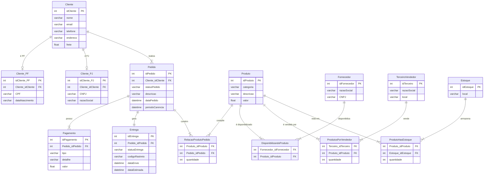

# 🛒 Projeto de E-Commerce – Diagrama EER Refinado (MySQL)

## 📊 Diagrama EER



## 📋 Narrativa do Projeto

### Produto
- Os produtos são vendidos por uma única plataforma online, mas podem ter vendedores distintos (terceiros)
- Cada produto possui um fornecedor
- Um ou mais produtos podem compor um pedido

### Cliente
- O cliente pode se cadastrar com CPF (PF) ou CNPJ (PJ), mas **não ambos**
- O endereço do cliente determina o valor do frete
- Um cliente pode realizar mais de um pedido; cada pedido possui um período de carência para devolução

### Pedido
- Pedidos são criados por clientes e possuem informações de compra, endereço e status da entrega
- Um ou mais produtos compõem o pedido
- O pedido pode ser cancelado

### Fornecedor & Estoque
- Cada produto possui um fornecedor associado
- O estoque é controlado por local e quantidade disponível por produto

---

## 🔧 Refinamentos Aplicados

Com base nos requisitos adicionais, as seguintes entidades foram inseridas ou modificadas:

| Entidade | Alteração |
|----------|-----------|
| `Cliente_PF` | Nova — especialização de Cliente com CPF e data de nascimento |
| `Cliente_PJ` | Nova — especialização de Cliente com CNPJ e razão social |
| `Pagamento` | Nova — um pedido pode ter mais de uma forma de pagamento |
| `Entrega` | Nova — possui status e código de rastreio, vinculada ao pedido |

> ⚠️ Um cliente pode ser **PF ou PJ**, nunca os dois ao mesmo tempo.

---

## 🗂️ Entidades e Atributos

### Cliente
| Coluna | Tipo | Restrição |
|--------|------|-----------|
| idCliente | INT | PK |
| nome | VARCHAR(45) | |
| email | VARCHAR(45) | |
| telefone | VARCHAR(45) | |
| endereco | VARCHAR(255) | |
| frete | FLOAT | |

### Cliente_PF *(especialização)*
| Coluna | Tipo | Restrição |
|--------|------|-----------|
| idCliente_PF | INT | PK |
| Cliente_idCliente | INT | FK → Cliente |
| CPF | VARCHAR(14) | UNIQUE |
| dataNascimento | VARCHAR(45) | |

### Cliente_PJ *(especialização)*
| Coluna | Tipo | Restrição |
|--------|------|-----------|
| idCliente_PJ | INT | PK |
| Cliente_idCliente | INT | FK → Cliente |
| CNPJ | VARCHAR(18) | UNIQUE |
| razaoSocial | VARCHAR(45) | |

### Pedido
| Coluna | Tipo | Restrição |
|--------|------|-----------|
| idPedido | INT | PK |
| Cliente_idCliente | INT | FK → Cliente |
| statusPedido | VARCHAR(45) | |
| descricao | VARCHAR(255) | |
| dataPedido | DATETIME | |
| periodoCarencia | DATETIME | |

### Pagamento
| Coluna | Tipo | Restrição |
|--------|------|-----------|
| idPagamento | INT | PK |
| Pedido_idPedido | INT | FK → Pedido |
| tipo | VARCHAR(45) | |
| detalhe | VARCHAR(45) | |
| valor | FLOAT | |

### Entrega
| Coluna | Tipo | Restrição |
|--------|------|-----------|
| idEntrega | INT | PK |
| Pedido_idPedido | INT | FK → Pedido |
| statusEntrega | VARCHAR(45) | |
| codigoRastreio | VARCHAR(45) | |
| dataEnvio | DATETIME | |
| dataEstimada | DATETIME | |

### Produto
| Coluna | Tipo | Restrição |
|--------|------|-----------|
| idProduto | INT | PK |
| categoria | VARCHAR(45) | |
| descricao | VARCHAR(45) | |
| valor | FLOAT | |

### Relacao_Produto_Pedido *(N:N)*
| Coluna | Tipo | Restrição |
|--------|------|-----------|
| Produto_idProduto | INT | FK → Produto |
| Pedido_idPedido | INT | FK → Pedido |
| quantidade | INT | |

### Fornecedor
| Coluna | Tipo | Restrição |
|--------|------|-----------|
| idFornecedor | INT | PK |
| razaoSocial | VARCHAR(45) | |
| CNPJ | VARCHAR(18) | |

### Disponibilizando_Produto *(N:N)*
| Coluna | Tipo | Restrição |
|--------|------|-----------|
| Fornecedor_idFornecedor | INT | FK → Fornecedor |
| Produto_idProduto | INT | FK → Produto |

### Terceiro_Vendedor
| Coluna | Tipo | Restrição |
|--------|------|-----------|
| idTerceiro | INT | PK |
| razaoSocial | VARCHAR(45) | |
| local | VARCHAR(45) | |

### Produtos_por_Vendedor *(N:N)*
| Coluna | Tipo | Restrição |
|--------|------|-----------|
| Terceiro_idTerceiro | INT | FK → Terceiro_Vendedor |
| Produto_idProduto | INT | FK → Produto |
| quantidade | INT | |

### Estoque
| Coluna | Tipo | Restrição |
|--------|------|-----------|
| idEstoque | INT | PK |
| local | VARCHAR(45) | |

### Produto_has_Estoque *(N:N)*
| Coluna | Tipo | Restrição |
|--------|------|-----------|
| Produto_idProduto | INT | FK → Produto |
| Estoque_idEstoque | INT | FK → Estoque |
| quantidade | INT | |

---

## 🔗 Relacionamentos
```
Cliente        ||--o|  Cliente_PF            : "é PF (opcional)"
Cliente        ||--o|  Cliente_PJ            : "é PJ (opcional)"
Cliente        ||--|{  Pedido                : "realiza"
Pedido         ||--|{  Pagamento             : "possui"
Pedido         ||--||  Entrega               : "gera"
Pedido         ||--|{  Relacao_Produto_Pedido: "contém"
Produto        ||--|{  Relacao_Produto_Pedido: "compõe"
Fornecedor     ||--|{  Disponibilizando_Produto : "disponibiliza"
Produto        ||--|{  Disponibilizando_Produto : "é disponibilizado por"
Terceiro       ||--|{  Produtos_por_Vendedor : "vende"
Produto        ||--|{  Produtos_por_Vendedor : "é vendido por"
Estoque        ||--|{  Produto_has_Estoque   : "armazena"
Produto        ||--|{  Produto_has_Estoque   : "está em"
```

---

## 🛠️ Tecnologias Utilizadas

- **MySQL Workbench** — modelagem EER
- **Mermaid.js** — diagrama no README

---

## 📌 Observações

- A especialização de `Cliente` em `PF` e `PJ` garante que um mesmo cadastro **não possa ter CPF e CNPJ simultaneamente**
- A entidade `Pagamento` em relação `1:N` com `Pedido` permite múltiplos meios de pagamento por pedido (cartão + boleto, por exemplo)
- A entidade `Entrega` em relação `1:1` com `Pedido` garante rastreabilidade com `statusEntrega` e `codigoRastreio`
